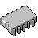
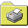

# Windows XP Icon Index (Detailed)

**Source Folder:** `Icons`

This index accounts for the **+1 Shift** in IDs and lists all available sizes.

| ID | Preview | Variants | Sizes Found | Identity |
| :---: | :---: | :---: | :--- | :--- |
| **1** | /11_size48.png) | 6 Files | 16px, 32px, 48px | **Default Document** |
| **2** | /12_size32.png) | 2 Files | 16px, 32px | **Default Document (Duplicate)** |
| **3** |  | 2 Files | 16px, 32px | Executable Application |
| **4** |  | 13 Files | 16px, 24px, 32px, 48px, 96px | Closed Folder |
| **5** |  | 9 Files | 16px, 32px, 48px | Open Folder |
| **6** |  | 6 Files | 16px, 32px, 48px | 5.25 Floppy Disk |
| **7** |  | 8 Files | 16px, 32px, 48px | 3.5 Floppy Disk |
| **8** |  | 6 Files | 16px, 32px, 48px | Removable Drive |
| **9** |  | 9 Files | 16px, 32px, 48px | Hard Disk Drive |
| **10** |  | 9 Files | 16px, 32px, 48px | Network Drive (Connected) |
| **11** |  | 9 Files | 16px, 32px, 48px | Network Drive (Disconnected) |
| **12** |  | 9 Files | 16px, 32px, 48px | CD-ROM Drive |
| **13** |  | 6 Files | 16px, 32px, 48px | RAM Chip |
| **14** |  | 9 Files | 16px, 32px, 48px | Entire Network (Globe) |
| **15** |  | 6 Files | 16px, 32px, 48px | Network Computer |
| **16** |  | 12 Files | 16px, 24px, 32px, 48px | My Computer |
| **17** |  | 8 Files | 16px, 32px, 48px | Server |
| **18** |  | 11 Files | 16px, 24px, 32px, 48px | Printer |
| **19** |  | 8 Files | 16px, 32px, 48px | Network Printer |
| **20** |  | 9 Files | 16px, 32px, 48px | Paint Image |
| **21** |  | 11 Files | 16px, 24px, 32px, 48px | History / Time |
| **22** |  | 12 Files | 16px, 24px, 32px, 48px | Recycle Bin (Mixed) |
| **23** |  | 12 Files | 16px, 24px, 32px, 48px | Help Book |
| **24** |  | 12 Files | 16px, 24px, 32px, 48px | Search (Magnifying Glass) |
| **25** |  | 11 Files | 16px, 24px, 32px, 48px | Information (Blue i) |
| **26** |  | 6 Files | 16px, 32px, 48px | Shutdown Button |
| **27** |  | 6 Files | 16px, 32px, 48px | Sharing Hand |
| **28** |  | 12 Files | 16px, 24px, 32px, 48px | Sharing Hand (Variant) |
| **29** |  | 9 Files | 16px, 32px, 48px | User Accounts |
| **30** |  | 2 Files | 16px, 32px | Shortcut Arrow |
| **31** |  | 2 Files | 16px, 32px | Icon 30 |
| **32** |  | 9 Files | 16px, 32px, 48px | Recycle Bin (Empty) |
| **33** |  | 9 Files | 16px, 32px, 48px | Recycle Bin (Full) |
| **34** |  | 6 Files | 16px, 32px, 48px | Dial-up Networking |
| **35** |  | 9 Files | 16px, 32px, 48px | Show Desktop |
| **36** |  | 2 Files | 16px, 32px | Control Panel |
| **37** |  | 9 Files | 16px, 32px, 48px | Program Group |
| **38** |  | 2 Files | 16px, 32px | Printers Folder |
| **39** |  | 9 Files | 16px, 32px, 48px | Fonts Folder |
| **40** |  | 6 Files | 16px, 32px | Windows Flag |
| **41** |  | 8 Files | 16px, 32px, 48px | Audio CD |
| **42** |  | 2 Files | 16px, 32px | Tree Structure |
| **43** |  | 4 Files | 16px, 32px | Multiple Documents |
| **44** |  | 12 Files | 16px, 24px, 32px, 48px | Favorites Star |
| **45** |  | 12 Files | 16px, 24px, 32px, 48px | Find Document |
| **46** |  | 9 Files | 16px, 32px, 48px | Help Temp |
| **47** |  | 9 Files | 16px, 32px, 48px | Icon 46 |
| **48** |  | 12 Files | 16px, 24px, 32px, 48px | Icon 47 |
| **49** |  | 2 Files | 16px, 32px | Icon 48 |
| **50** |  | 1 Files | 16px | Icon 49 |
| **51** |  | 1 Files | 16px | Icon 50 |
| **52** |  | 1 Files | 16px | Icon 51 |
| **53** |  | 1 Files | 16px | Icon 52 |
| **54** |  | 6 Files | 16px, 32px, 48px | Icon 53 |
| **133** |  | 2 Files | 16px, 32px | Icon 132 |
| **134** |  | 11 Files | 16px, 24px, 32px, 48px | Icon 133 |
| **135** |  | 2 Files | 16px | Icon 134 |
| **137** |  | 12 Files | 16px, 24px, 32px, 48px | Icon 136 |
| **138** |  | 11 Files | 16px, 24px, 32px, 48px | Run Dialog |
| **139** |  | 9 Files | 16px, 32px, 48px | Icon 138 |
| **140** |  | 9 Files | 16px, 32px, 48px | Icon 139 |
| **141** |  | 9 Files | 16px, 32px, 48px | Icon 140 |
| **142** |  | 1 Files | 32px | Icon 141 |
| **143** |  | 1 Files | 32px | Icon 142 |
| **144** |  | 1 Files | 32px | Icon 143 |
| **145** |  | 1 Files | 32px | Icon 144 |
| **146** |  | 7 Files | 16px, 32px, 48px | Icon 145 |
| **147** |  | 6 Files | 16px, 32px, 48px | Icon 146 |
| **148** |  | 1 Files | 32px | Icon 147 |
| **151** |  | 9 Files | 16px, 32px, 47px, 48px | Icon 150 |
| **152** |  | 8 Files | 16px, 32px, 48px | Icon 151 |
| **153** |  | 2 Files | 16px, 32px | Icon 152 |
| **154** |  | 9 Files | 16px, 32px, 48px | Icon 153 |
| **155** |  | 8 Files | 16px, 32px, 48px | Icon 154 |
| **156** |  | 8 Files | 16px, 32px, 48px | Icon 155 |
| **157** |  | 8 Files | 16px, 32px, 48px | Icon 156 |
| **160** |  | 11 Files | 16px, 24px, 32px, 48px | Icon 159 |
| **161** |  | 2 Files | 32px | Icon 160 |
| **165** |  | 8 Files | 16px, 32px, 48px | Icon 164 |
| **166** |  | 1 Files | 32px | Icon 165 |
| **167** |  | 8 Files | 16px, 32px, 48px | Icon 166 |
| **168** |  | 9 Files | 16px, 32px, 48px | Icon 167 |
| **169** |  | 9 Files | 16px, 32px, 48px | Icon 168 |
| **170** |  | 9 Files | 16px, 32px, 48px | Icon 169 |
| **171** |  | 3 Files | 16px, 32px, 48px | Icon 170 |
| **172** |  | 6 Files | 16px, 32px, 48px | Icon 171 |
| **173** |  | 12 Files | 16px, 24px, 32px, 48px | Icon 172 |
| **174** |  | 2 Files | 32px | Icon 173 |
| **175** |  | 11 Files | 16px, 24px, 32px, 48px | Icon 174 |
| **176** |  | 6 Files | 16px, 32px, 48px | Icon 175 |
| **177** |  | 2 Files | 16px, 32px | Icon 176 |
| **178** |  | 9 Files | 16px, 32px, 48px | Icon 177 |
| **179** |  | 2 Files | 16px, 32px | Icon 178 |
| **180** |  | 1 Files | 32px | Icon 179 |
| **181** |  | 1 Files | 32px | Icon 180 |
| **182** |  | 1 Files | 32px | Icon 181 |
| **183** |  | 1 Files | 32px | Icon 182 |
| **184** |  | 2 Files | 32px | Icon 183 |
| **185** |  | 2 Files | 32px | Icon 184 |
| **186** |  | 1 Files | 32px | Icon 185 |
| **187** |  | 1 Files | 32px | Icon 186 |
| **191** |  | 6 Files | 16px, 32px, 48px | Icon 190 |
| **192** |  | 6 Files | 16px, 32px, 48px | Icon 191 |
| **193** |  | 6 Files | 16px, 32px, 48px | Icon 192 |
| **194** |  | 1 Files | 32px | Icon 193 |
| **196** |  | 8 Files | 16px, 32px, 48px | Icon 195 |
| **197** |  | 8 Files | 16px, 32px, 48px | Icon 196 |
| **198** |  | 8 Files | 16px, 32px, 48px | Icon 197 |
| **199** |  | 8 Files | 16px, 32px, 48px | Icon 198 |
| **200** |  | 8 Files | 16px, 32px, 48px | Icon 199 |
| **210** |  | 9 Files | 16px, 32px, 48px | Icon 209 |
| **220** |  | 6 Files | 16px, 32px, 48px | Icon 219 |
| **221** |  | 6 Files | 16px, 32px, 48px | Folder (Music) |
| **222** |  | 8 Files | 16px, 32px, 48px | Icon 221 |
| **223** |  | 2 Files | 32px | Icon 222 |
| **224** |  | 6 Files | 16px, 32px, 48px | Icon 223 |
| **225** |  | 6 Files | 16px, 32px, 48px | Icon 224 |
| **226** |  | 6 Files | 16px, 32px, 48px | Icon 225 |
| **227** |  | 6 Files | 16px, 32px, 48px | Icon 226 |
| **228** |  | 2 Files | 16px, 32px | Icon 227 |
| **229** |  | 6 Files | 16px, 32px, 48px | Icon 228 |
| **230** |  | 6 Files | 16px, 32px, 48px | Icon 229 |
| **231** |  | 2 Files | 16px, 32px | Icon 230 |
| **232** |  | 2 Files | 16px, 32px | Icon 231 |
| **233** |  | 6 Files | 16px, 32px, 48px | Icon 232 |
| **234** |  | 1 Files | 32px | Icon 233 |
| **235** |  | 12 Files | 16px, 24px, 32px, 48px | Icon 234 |
| **236** |  | 12 Files | 16px, 24px, 32px, 48px | My Music |
| **237** |  | 12 Files | 16px, 24px, 32px, 48px | My Pictures |
| **238** |  | 12 Files | 16px, 24px, 32px, 48px | My Videos |
| **239** |  | 9 Files | 16px, 32px, 48px | Icon 238 |
| **240** |  | 6 Files | 16px, 32px, 48px | Icon 239 |
| **241** |  | 2 Files | 16px | Icon 240 |
| **242** |  | 6 Files | 16px, 32px, 48px | Icon 241 |
| **243** |  | 2 Files | 16px | Icon 242 |
| **244** |  | 6 Files | 16px, 32px, 48px | Icon 243 |
| **245** |  | 8 Files | 16px, 32px, 48px | Icon 244 |
| **246** |  | 2 Files | 16px | Icon 245 |
| **247** |  | 2 Files | 16px | Icon 246 |
| **248** |  | 6 Files | 16px, 32px, 48px | Icon 247 |
| **249** |  | 4 Files | 16px, 32px | Icon 248 |
| **250** |  | 9 Files | 16px, 32px, 48px | Icon 249 |
| **251** |  | 6 Files | 16px, 32px, 40px, 48px | Icon 250 |
| **252** |  | 6 Files | 16px, 32px, 48px | Icon 251 |
| **253** |  | 2 Files | 16px | Icon 252 |
| **254** |  | 9 Files | 16px, 32px, 48px | Icon 253 |
| **255** |  | 2 Files | 16px | Icon 254 |
| **256** |  | 7 Files | 16px, 32px, 48px | Icon 255 |
| **257** |  | 11 Files | 16px, 24px, 32px, 48px | Icon 256 |
| **258** |  | 6 Files | 16px, 32px, 48px | Icon 257 |
| **259** |  | 6 Files | 16px, 32px, 48px | Icon 258 |
| **260** |  | 2 Files | 16px | Icon 259 |
| **261** |  | 2 Files | 16px | Icon 260 |
| **262** |  | 2 Files | 16px | Icon 261 |
| **263** |  | 12 Files | 16px, 24px, 32px, 48px | Icon 262 |
| **264** |  | 2 Files | 16px | Icon 263 |
| **265** |  | 2 Files | 16px | Icon 264 |
| **266** |  | 2 Files | 16px | Icon 265 |
| **267** |  | 9 Files | 16px, 32px, 48px | Icon 266 |
| **268** |  | 9 Files | 15px, 16px, 32px, 48px | Icon 267 |
| **269** |  | 9 Files | 16px, 32px, 48px | Icon 268 |
| **270** |  | 6 Files | 16px, 32px, 48px | Icon 269 |
| **271** |  | 9 Files | 16px, 32px, 48px | Icon 270 |
| **272** |  | 6 Files | 16px, 32px, 48px | Icon 271 |
| **273** |  | 6 Files | 16px, 32px, 48px | Icon 272 |
| **274** |  | 6 Files | 16px, 32px, 48px | Icon 273 |
| **275** |  | 6 Files | 16px, 32px, 48px | Icon 274 |
| **276** |  | 6 Files | 16px, 32px, 48px | Icon 275 |
| **277** |  | 6 Files | 16px, 32px, 48px | Icon 276 |
| **278** |  | 8 Files | 16px, 32px, 48px | Icon 277 |
| **279** |  | 9 Files | 16px, 32px, 48px | Icon 278 |
| **281** |  | 8 Files | 16px, 32px, 48px | Icon 280 |
| **282** |  | 8 Files | 16px, 31px, 32px, 48px | Icon 281 |
| **283** |  | 8 Files | 16px, 32px, 48px | Icon 282 |
| **284** |  | 3 Files | 16px | Icon 283 |
| **289** |  | 6 Files | 16px, 32px, 39px, 48px | Icon 288 |
| **290** |  | 1 Files | 16px | Icon 289 |
| **291** |  | 6 Files | 16px, 32px, 48px | Security Shield |
| **292** |  | 9 Files | 16px, 32px, 48px | Icon 291 |
| **293** |  | 8 Files | 16px, 32px, 48px | Icon 292 |
| **294** |  | 8 Files | 16px, 32px, 48px | Icon 293 |
| **295** |  | 8 Files | 16px, 32px, 48px | Icon 294 |
| **296** |  | 8 Files | 16px, 32px, 48px | Icon 295 |
| **297** |  | 8 Files | 16px, 32px, 48px | Icon 296 |
| **298** |  | 6 Files | 16px, 32px, 48px | Icon 297 |
| **299** |  | 6 Files | 16px, 32px, 48px | Icon 298 |
| **300** |  | 6 Files | 16px, 32px, 48px | Icon 299 |
| **301** |  | 6 Files | 16px, 32px, 48px | Icon 300 |
| **302** |  | 8 Files | 16px, 32px, 48px | Icon 301 |
| **303** |  | 6 Files | 16px, 32px, 48px | Icon 302 |
| **304** |  | 8 Files | 16px, 32px, 48px | Icon 303 |
| **305** |  | 6 Files | 16px, 32px, 48px | Icon 304 |
| **306** |  | 7 Files | 16px, 32px, 48px | Icon 305 |
| **307** |  | 6 Files | 16px, 32px, 48px | Icon 306 |
| **308** |  | 6 Files | 16px, 32px, 48px | Icon 307 |
| **309** |  | 6 Files | 16px, 32px, 48px | Icon 308 |
| **310** |  | 6 Files | 16px, 32px, 48px | Icon 309 |
| **311** |  | 6 Files | 16px, 32px, 48px | Icon 310 |
| **312** |  | 6 Files | 16px, 32px, 48px | Icon 311 |
| **313** |  | 6 Files | 16px, 32px, 48px | Icon 312 |
| **314** |  | 6 Files | 16px, 32px, 48px | Icon 313 |
| **315** |  | 9 Files | 16px, 32px, 48px | Icon 314 |
| **316** |  | 9 Files | 16px, 32px, 48px | Icon 315 |
| **317** |  | 9 Files | 16px, 32px, 48px | Icon 316 |
| **318** |  | 8 Files | 16px, 32px, 48px | Icon 317 |
| **319** |  | 6 Files | 16px, 32px, 48px | Icon 318 |
| **320** |  | 2 Files | 16px | Icon 319 |
| **321** |  | 12 Files | 16px, 24px, 32px, 48px | Icon 320 |
| **322** |  | 9 Files | 16px, 32px, 48px | Icon 321 |
| **323** |  | 9 Files | 16px, 32px, 48px | Icon 322 |
| **324** |  | 9 Files | 16px, 32px, 48px | Icon 323 |
| **325** |  | 9 Files | 16px, 32px, 48px | Icon 324 |
| **326** |  | 9 Files | 16px, 32px, 48px | Icon 325 |
| **327** |  | 9 Files | 16px, 32px, 48px | Icon 326 |
| **328** |  | 9 Files | 16px, 32px, 48px | Icon 327 |
| **329** |  | 9 Files | 16px, 32px, 48px | Icon 328 |
| **330** |  | 9 Files | 16px, 32px, 48px | Icon 329 |
| **331** |  | 9 Files | 16px, 32px, 48px | Icon 330 |
| **337** |  | 6 Files | 16px, 32px, 48px | Icon 336 |
| **338** |  | 8 Files | 16px, 32px, 48px | Icon 337 |
| **512** |  | 9 Files | 16px, 32px, 48px | Icon 511 |
| **1001** |  | 9 Files | 16px, 32px, 48px | Icon 1000 |
| **1002** |  | 2 Files | 16px | Icon 1001 |
| **1003** |  | 2 Files | 16px | Icon 1002 |
| **1004** |  | 6 Files | 16px, 32px, 39px, 48px | Icon 1003 |
| **1005** |  | 2 Files | 16px | Icon 1004 |
| **1006** |  | 2 Files | 16px | Icon 1005 |
| **1007** |  | 2 Files | 16px | Icon 1006 |
| **1008** |  | 2 Files | 16px | Icon 1007 |
| **1009** |  | 2 Files | 16px | Icon 1008 |
| **1010** |  | 2 Files | 16px | Icon 1009 |
| **1011** |  | 6 Files | 16px, 32px | Icon 1010 |
| **8240** |  | 2 Files | 16px, 32px | Icon 8239 |
| **16710** |  | 2 Files | 32px | Icon 16709 |
| **16715** |  | 2 Files | 32px | Icon 16714 |
| **16717** |  | 2 Files | 32px | Icon 16716 |
| **16718** |  | 2 Files | 32px | Icon 16717 |
| **16721** |  | 2 Files | 32px | Icon 16720 |
